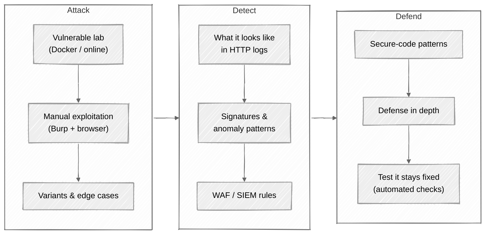

# AppSec Mastery: Hands-On Web Security

> A 16-week mentorship curriculum that teaches web application security through **deliberate practice**.
> Each week takes one vulnerability class, walks you through exploiting it in a lab environment, then shows you how to detect and defend against it in real systems.

🌟 Star this repo if you're learning AppSec or transitioning from software engineering into security.

## ⚠️ Ethics & Scope

**Everything in this repo is lab-only.** Every exploit walkthrough targets deliberately-vulnerable applications you run on your own machine (Docker), use through dedicated training platforms (PortSwigger Web Security Academy, HackTheBox, TryHackMe), or stand up in disposable VMs.

**Never test against systems you don't own or don't have explicit written authorization to test.** Unauthorized testing is illegal under the Computer Fraud and Abuse Act (US), Computer Misuse Act (UK), and equivalent laws worldwide. The same technique that earns you a CTF flag in lab earns you a felony charge in production.

This curriculum is for: security engineers, defenders learning attacker tradecraft, software engineers building secure applications, and CTF / bug-bounty practitioners working within program scope.

## 🎯 Why this exists

Most AppSec resources teach the concepts ("SQL injection is when..."). Few make you actually exploit a real query, watch what it looks like in a log, and write the fix. This curriculum does all three, every week.

## 🧭 The attack → detect → defend cycle

Every week follows the same three-phase loop, so by Week 03 the rhythm becomes muscle memory:

## 📁 Curriculum

| ☐ | Week | Topic | Difficulty | OWASP Mapping |
|---|------|-------|------------|---------------|
| ☐ | 01 | [HTTP, Burp, and reflected XSS](week-01-http-and-burp) | ⭐ | A03 |
| ☐ | 02 | [Sessions, cookies, and JWTs](week-02-sessions-and-cookies) | ⭐ | A07 |
| ☐ | 03 | [Broken access control & IDOR](week-03-broken-access-control) | ⭐ | A01 |
| ☐ | 04 | [Authentication failures](week-04-auth-failures) | ⭐⭐ | A07 |
| ☐ | 05 | [SQL injection](week-05-sql-injection) | ⭐⭐ | A03 |
| ☐ | 06 | [Stored & DOM XSS, CSP bypass](week-06-xss-deep) | ⭐⭐ | A03 |
| ☐ | 07 | [SSTI & command injection](week-07-ssti-and-command-injection) | ⭐⭐⭐ | A03 |
| ☐ | 08 | [Server-side request forgery (SSRF)](week-08-ssrf) | ⭐⭐⭐ | A10 |
| ☐ | 09 | [CSRF, SameSite, SOP, CORS](week-09-csrf-cors-sop) | ⭐⭐ | A01 |
| ☐ | 10 | [Cryptographic failures](week-10-crypto-failures) | ⭐⭐⭐ | A02 |
| ☐ | 11 | [Insecure deserialization](week-11-insecure-deserialization) | ⭐⭐⭐⭐ | A08 |
| ☐ | 12 | [XXE, file upload, path traversal](week-12-xxe-upload-traversal) | ⭐⭐⭐ | A03 |
| ☐ | 13 | [API security (REST + GraphQL)](week-13-api-security) | ⭐⭐⭐ | A01/A03 |
| ☐ | 14 | [Security misconfig & vulnerable components](week-14-security-misconfig) | ⭐⭐ | A05/A06 |
| ☐ | 15 | [Logging, monitoring, detection](week-15-logging-and-detection) | ⭐⭐⭐ | A09 |
| ☐ | 16 | [Threat modeling capstone](week-16-capstone) | ⭐⭐⭐⭐ | A04 |

> 🚧 **Currently scaffolded.** [Week 01](week-01-http-and-burp) is fully fleshed
> as the format reference. Weeks 02–16 have skeleton files in place and will be
> filled in over time.

## 🛠️ Required Tools

| Tool | Purpose | Notes |
|------|---------|-------|
| **[Burp Suite Community](https://portswigger.net/burp/communitydownload)** | Intercepting proxy — the AppSec tester's primary tool | Free; Pro is great but Community is enough for this curriculum |
| **[Docker](https://www.docker.com/)** | Local labs (DVWA, Juice Shop, custom apps) | Compose files included per week |
| **A modern browser + DevTools** | Inspecting requests, debugging client-side JS | Firefox or Chrome |
| **[PortSwigger Web Security Academy](https://portswigger.net/web-security)** | Free interactive labs by the makers of Burp | Account required (free) |
| **[OWASP Juice Shop](https://owasp.org/www-project-juice-shop/)** | Modern intentionally-vulnerable app | Runs in Docker |
| **[DVWA](https://github.com/digininja/DVWA)** | Classic PHP vulnerable app | Runs in Docker |

## 📋 How each week works

Open the week's folder. You'll find three files:

| File | What it's for |
|------|---------------|
| `readme.md` | The **topic + lab setup**. What you'll learn, how to spin up the lab, recommended reading. Try it yourself first. |
| `attack.md` | The **exploit walkthrough**. Step-by-step exploitation in the lab — what to send, what to observe, common variants. |
| `defense.md` | The **detection + remediation**. What this attack looks like in logs, how to detect it, secure-coding patterns, automated tests. |

**Recommended flow:**

1. Read the `readme.md` and spin up the lab.
2. **Try to exploit it yourself first.** Even if you don't fully succeed, struggle for 30 minutes. The struggle is the learning.
3. Open `attack.md` to compare your approach.
4. Read `defense.md` last — pay close attention to the detection signatures and secure-coding patterns.

## 🚀 Getting Started

1. Fork this repo.
2. `git clone` your fork.
3. Install Burp Suite Community and Docker.
4. Open [Week 01: HTTP, Burp, and Reflected XSS](week-01-http-and-burp) and start.

## 🎓 Learning Philosophy

1. **Exploit before defend.** You can't write a meaningful fix until you've broken it yourself.
2. **Labs only.** Every technique here is run against deliberately-vulnerable apps. Never against systems you don't own.
3. **Read RFCs, not blog posts.** When something matters, the spec is shorter than the blog post about it.
4. **Defense in depth.** No single control catches everything. The right answer is usually "this control plus that one."
5. **Detection matters more than prevention.** Eventually something gets through. Logs are your only post-incident witness.

## 📚 Recommended Reading

- *The Web Application Hacker's Handbook* — still the canonical text
- *Real-World Bug Hunting* — Pete Yaworski, with real disclosure stories
- [OWASP Top 10 (2021)](https://owasp.org/Top10/) — the framing the industry uses
- [PortSwigger Web Security Academy](https://portswigger.net/web-security) — free, exhaustive
- [Google's Bughunter University](https://bughunters.google.com/learn) — modern, well-curated

## 🔗 Contributing

Found a better exploitation technique, a clearer secure-code pattern, or an outdated link? Open a PR.

---

**Ready?** Start with [Week 01: HTTP, Burp, and Reflected XSS →](week-01-http-and-burp)
