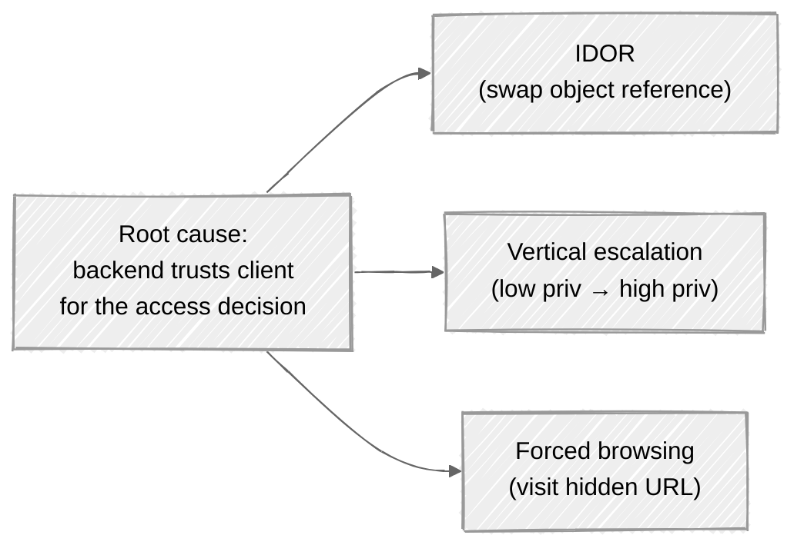

# Week 03: Attack walkthrough - Broken Access Control & IDOR

> ⚠️ **Lab only.**

---

## The mental model

Broken access control happens when the server *trusts the client* to enforce a rule the server should be enforcing. Three flavors that look very different but share the same root cause:



Once you internalize the root cause, the three flavors collapse into one heuristic: **for every authenticated action, ask what the server is checking and what it's trusting the client to have already filtered.**

## Attack 1: Classic IDOR via ID in URL

The simplest. Account page at:

```
GET /api/users/123/profile
```

Your user ID is 123. Try 124.

If the response returns user 124's profile, that's an IDOR. The server is using "authenticated session" as proof of identity, but not as proof of *authorization to read user 124*.

### IDOR exploit lifecycle

1. **Find an ID parameter.** Could be `?id=`, `/users/{id}`, JSON body field, hidden form input.
2. **Enumerate.** Try ±1, ±10, ±100. Try the IDs of accounts you control. Try `0`, `-1`, `1`, `999999`.
3. **Observe the response.** Does it leak content? Different error codes for "exists vs. not exists"? That's enumeration even if the data is hidden.
4. **Chain it.** Read other users' messages → harvest password reset tokens → take over accounts → escalate.

### IDOR in less-obvious places

| Where | Example |
|---|---|
| URL path | `/orders/4451` |
| Query string | `?account=u_4451` |
| JSON body | `{"order_id": 4451}` |
| Form parameter | hidden `<input name=order_id value=4451>` |
| Header | `X-User-ID: 4451` |
| Cookie | `current_org=acme-corp` |
| GraphQL variable | `{"variables": {"orderId": 4451}}` |
| Filename in path | `/exports/2026-05-22-acme-corp.csv` |
| S3 / object-store URL | `s3://uploads/uploaded-by/u_4451/avatar.png` |
| Encoded in a token | `?token=eyJvcmRlcl9pZCI6NDQ1MX0=` (decode the JSON inside) |

**The encoded-token case is the dangerous one.** Developers think "this token is opaque" - it's just base64'd JSON with no signature. Decode, change the ID, re-encode, send.

## Attack 2: Horizontal privilege escalation

You're user A. You change an ID to point at user B (same role, different account). If it works, you've moved sideways:

```
GET /api/users/B/messages
GET /api/users/B/billing
POST /api/users/B/payment-method  body: {"card_token": "stolen"}
```

Horizontal escalation often goes unreported because nothing "elevated." But user-to-user data theft is the single most common bug-bounty payload.

## Attack 3: Vertical privilege escalation

You're a regular user. You try a request normally reserved for admins:

```
DELETE /api/users/123    # only admin should be able to do this
POST   /api/admin/promote/me    # endpoint expects role check
PATCH  /api/users/123 { "role": "admin" }    # mass-assignment combined with weak auth
```

Vertical escalation in practice:

1. **Inventory the admin UI.** What endpoints does the admin panel hit? (Burp shows you this when an admin is logged in; capture an admin's traffic on a system you own, or read the JS files for endpoint hints.)
2. **Replay them as a regular user.** Many systems show/hide UI based on role but allow the endpoint regardless.
3. **Try `X-Original-Role: admin` and similar header tricks.** Some apps proxy headers from a trusted gateway; if the gateway is missing, the header is attacker-controlled.

## Attack 4: Forced browsing - admin URLs that aren't hidden

If the admin panel is at `/admin` and unauthenticated users can visit it, that's the bug:

```
GET /admin
GET /admin/users
GET /internal/dashboard
GET /debug
GET /backup
```

Wordlists for this exist (SecLists is the standard). Tools: **ffuf**, **dirsearch**, **gobuster**.

```bash
ffuf -w common-paths.txt -u http://target.local/FUZZ -mc 200,302,401,403
```

In lab only. The 401/403 responses are interesting - they tell you the endpoint exists but you're not allowed in. Sometimes those routes have a separate weakness that lets you in anyway (see attack 5).

## Attack 5: URL-based access control circumvention

Some apps "protect" admin URLs at the load balancer / WAF layer:

```
LB rule: deny /admin/* unless X-Internal-Auth header present
```

Trivially bypassed if:

- **Path normalization differs:** `/admin/..//users` may not match `/admin/*` at the LB but routes to the same handler at the backend.
- **Trailing slash:** `/admin` blocked, `/admin/` allowed.
- **Encoded slash:** `/%2fadmin/users`
- **Mixed-case URL:** `/Admin/users` - match is case-sensitive at LB, insensitive at backend.

This is the "URL-based access control can be circumvented" PortSwigger lab. The fix is to do auth in the application, not at the proxy.

## Attack 6: HTTP method override

Some APIs let clients override the HTTP method via a header or `_method` parameter (used by old browsers that only spoke GET/POST). If the access control checks only the *visible* method:

```
POST /api/users/123
X-HTTP-Method-Override: DELETE
```

Or:

```
POST /api/users/123
Content-Type: application/x-www-form-urlencoded

_method=DELETE&id=123
```

If the server's middleware reads `_method` before the auth check runs, you've bypassed it.

## Attack 7: Method-based access control gaps

Same endpoint, different methods, different protections. A common pattern:

```
GET /api/users/123     # protected - checks "can read"
PATCH /api/users/123   # protected - checks "can edit"
DELETE /api/users/123  # forgotten - no check at all
```

Test every method on every authenticated endpoint. `OPTIONS` is good for enumeration; `DELETE` and `PUT` are most often forgotten.

## Attack 8: GraphQL access control

GraphQL collapses many endpoints into one (`POST /graphql`). Access control has to live in the resolvers, but it often only lives on a few of them.

```graphql
query StealAdminData {
  user(id: 1) {
    email
    passwordResetToken    # this field should be admin-only
    twoFactorRecoveryCodes
  }
}
```

Field-level access control gaps are everywhere in GraphQL APIs. Test by querying every field you can find via introspection.

## Attack 9: Mass assignment (related, often co-occurs)

A profile update endpoint:

```
PATCH /api/users/me
{
  "name": "Alice",
  "email": "alice@example.com",
  "role": "admin"           ← server blindly persists this
}
```

If the server uses an ORM `update(**body)` style without an allow-list, you've just made yourself admin. Combined with weak authorization, this is the chain that wins root.

## Attack 10: Privilege escalation via "feature gating"

Some apps gate functionality by *paid tier* via client-side checks only:

```js
if (user.tier === 'premium') {
  enableExport();
}
```

The export endpoint itself doesn't check. Manually call it.

The same pattern hits role-based features all the time.

## Common mistakes when learning

- **Stopping at "I can read user 124's profile."** Chain it. Reading users → finding tokens → password resets → account takeover.
- **Not testing every HTTP method.** `DELETE` is forgotten more often than `GET`.
- **Trusting client-side hiding.** A hidden menu item is not an access control.
- **Only testing your own user's data.** Test with two accounts so you can move sideways.
- **Forgetting GraphQL.** Each field is its own access control surface.

Now read [defense.md](defense.md).
