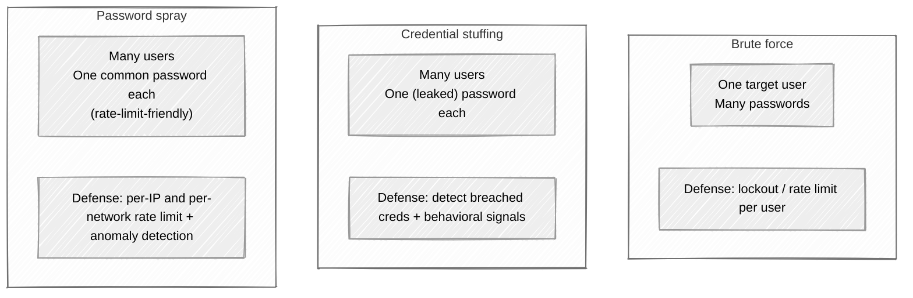

# Week 04: Attack walkthrough - Authentication Failures

> ⚠️ **Lab only.** Never run authentication attacks against systems you don't own.

---

## The three attacks are not the same



Tell them apart in real traffic, because the defense for each is different. A team that blocks one with the wrong control is wide open to the other two.

## Attack 1: Account enumeration

Before brute-forcing, you need targets. Account enumeration is the recon step - figuring out which usernames exist.

### Enumeration via different responses

Login form. Submit `alice@example.com / wrong-password`:

```
HTTP/1.1 401 Unauthorized
{"error": "Incorrect password"}
```

Submit `nobody@example.com / wrong-password`:

```
HTTP/1.1 401 Unauthorized
{"error": "No account with that email"}
```

You've just enumerated. Try a list of common emails and harvest the ones that say "incorrect password."

### Enumeration via subtle differences

A patched app returns the same error message in both cases - but the **response time differs**:

| Username | Response time |
|---|---|
| Valid (alice@example.com) | 250 ms (bcrypt comparison) |
| Invalid (nobody@example.com) | 50 ms (early return, no hash) |

The 200ms gap is the bug. The fix is to do a dummy bcrypt comparison even when the user doesn't exist, so timing is uniform.

### Enumeration via response size

Login returns a JSON shape that varies subtly:

```
Valid user, wrong password: {"error": "auth_failed", "remaining_attempts": 4}
Invalid user:               {"error": "auth_failed"}
```

Burp's "Logger++" or the built-in Comparer makes this obvious - sort responses by length.

### Enumeration via password reset

```
POST /api/password-reset
{"email": "alice@example.com"}
→ 200 OK "Reset link sent if account exists"

POST /api/password-reset
{"email": "nobody@example.com"}
→ 200 OK "Reset link sent if account exists"
```

That's the *right* behavior. But many apps slip:

```
POST /api/password-reset
{"email": "nobody@example.com"}
→ 404 Not Found    ← enumeration
```

Or the *response time* differs (sending an email is slow; not sending is fast).

### Enumeration via registration

```
POST /api/signup
{"email": "alice@example.com"}
→ 400 Bad Request "Email already registered"
```

Different from "email is invalid." Enumerated.

## Attack 2: Brute force with rate-limit bypasses

You have a target username. Time to try passwords.

### Naive brute force

```
POST /login
{"username": "alice", "password": "password123"}
{"username": "alice", "password": "qwerty"}
{"username": "alice", "password": "letmein"}
... etc
```

In Burp, use **Intruder** with a password wordlist (rockyou.txt is the canonical, ~14M entries; SecLists has shorter targeted lists).

A properly defended app blocks you at 5-10 attempts. The interesting attacks are the bypasses.

### Bypass: header-based "real IP"

The app rate-limits by `X-Forwarded-For` (taken from the CDN/LB). If the IP is *attacker-controlled*:

```
POST /login
X-Forwarded-For: 1.1.1.1
{"username": "alice", "password": "p1"}

POST /login
X-Forwarded-For: 1.1.1.2
{"username": "alice", "password": "p2"}
```

Rotate the spoofed IP. Rate limit per "IP" sees one attempt per IP. Bypassed.

The right behavior is to take the real client IP from the LB (using a trusted header position) and **not** trust client-supplied `X-Forwarded-For`.

### Bypass: parameter pollution

```
POST /login
username=alice&password=p1&password=p2&password=p3
```

Some web frameworks take the first `password`; others take the last; some concatenate. If the rate-limit logic looks at one field but auth uses another, you get free attempts per request.

### Bypass: case / whitespace variation

```
username: alice
username: ALICE
username: Alice
username: alice
username:  alice    ← leading space
```

If the rate limiter keys on the *literal* username string but the auth backend normalizes case/whitespace, each variant gets its own attempt counter.

### Bypass: account-lockout enumeration

Some apps lock the account after N bad attempts. An attacker:

1. Tries 10 passwords for `alice` → account locked.
2. Tries `alice` with the correct password - still locked, returns "account locked."
3. The "account locked" response leaks that account-locked is a *valid* state.

The Mitigation: lock the **session/IP**, not the account. Or use throttling instead of lockout.

### Bypass: race condition on attempt counter

```
Time T:    50 parallel POST /login requests with different passwords for alice
```

If the rate-limit increment isn't atomic (read counter, increment, write), the parallel requests all see the same "below limit" state and all proceed.

## Attack 3: Credential stuffing

You have a credential dump from a previous breach (Pastebin, breach forums, etc.). You hit a *different* site with the same credentials, on the bet that users reuse passwords.

```python
for email, password in leaked_credentials:
    response = login(email, password)
    if response.status_code == 200:
        valid_creds.append((email, password))
```

Defenses based on per-user rate limits don't help - each user is only tried once. The attacker is **wide, not deep.**

Real stuffing tools:

- **Sentry MBA / OpenBullet** - automation frameworks with configurable per-target "configs"
- Residential-proxy networks rotate IPs
- Headless browsers solve CAPTCHAs via 3rd-party CAPTCHA solving services

The defender's signal: same source running diverse usernames, low success rate, high volume.

## Attack 4: Password spray

Inverse of brute force. One password, many users:

```
alice / Password2026
bob   / Password2026
carol / Password2026
...
```

Common passwords: `Password<year>`, `Welcome<year>`, the company name + year, `Summer<year>!`.

Rate limits per username allow this trivially. Defense: detect *the same password being tried across users from one source* - that's the spray pattern.

## Attack 5: MFA bypass - brute force

The 6-digit TOTP code at MFA. 1,000,000 possibilities. If the app doesn't rate limit the *MFA verification* step:

```
POST /api/mfa/verify
{"code": "000000"}
{"code": "000001"}
...
{"code": "999999"}
```

At a few hundred requests/sec, you exhaust the space in under an hour. The PortSwigger "2FA bypass by brute force" lab.

The fix is obvious in retrospect: rate-limit MFA verification per session, lock after N attempts.

## Attack 6: MFA bypass - recovery code abuse

MFA recovery codes (the "save these in case you lose your phone" codes) are often:

- Stored less securely than the MFA secret
- Logged in plaintext during reset flows
- Reusable (not single-use)
- Generated with weak entropy

Stealing or guessing a recovery code circumvents MFA without needing to compromise the device.

## Attack 7: MFA bypass - fallback channel

A user with MFA enabled forgets their second factor. The "I lost my phone" link triggers an SMS recovery, an email recovery, or a security-question flow.

The MFA's actual strength = the weakest of these fallback channels. If the fallback is email and the email account isn't itself MFA-protected, attacker steals email → triggers MFA reset → no MFA.

## Attack 8: MFA bypass - push fatigue

In a push-notification MFA flow ("approve this login on your phone"):

1. Attacker has valid username+password (from a previous compromise).
2. Attacker logs in repeatedly. Each attempt fires a push to the victim.
3. Victim taps "approve" out of annoyance - or while half-asleep.

Real-world. The 2022 Uber breach used exactly this pattern.

## Attack 9: Password reset token leakage

A password-reset email contains a link:

```
https://example.com/reset?token=eyJ1c2VyX2lkIjoxLCJleHAiOjE2OTk5OTk5OTl9
```

Things to look for:

- **Token in HTTP-Referer:** if the reset page links to anything external (an image, analytics), the token leaks in the Referer header.
- **Token predictable:** decode it. Is it JSON? Sequential? Time-based with low entropy?
- **Token never expires:** still valid weeks later.
- **Token reusable:** can be used twice.
- **Token swap-able between users:** decode → change user_id → re-encode (the IDOR pattern from Week 03).
- **Host header injection:** the reset email is built by taking the `Host` header from the request. An attacker submits the reset form with `Host: attacker.example`. The email contains `https://attacker.example/reset?token=...`. Victim clicks, leaks token.

The Host-header trick is the PortSwigger "Password reset poisoning via middleware" lab.

## Attack 10: "Remember me" cookies

Already touched on in [Week 02](../week-02-sessions-and-cookies/attack.md#attack-10-remember-me-tokens), but worth restating: remember-me cookies often bypass MFA entirely, have long TTLs, and use weaker tokens than session cookies. They're a richer attack surface than the session itself.

## Common mistakes when learning

- **Conflating brute force and credential stuffing.** Different attacks, different defenses.
- **Not checking response timing.** Many enumeration vulns hide in timing differences.
- **Skipping the recovery flow.** That's where most MFA bypasses live.
- **Treating CAPTCHA as a defense.** It's a speed bump. Real attackers use solving services.
- **Trusting `X-Forwarded-For` everywhere.** Especially in rate-limit code.

Now read [defense.md](defense.md) for what stops this.
