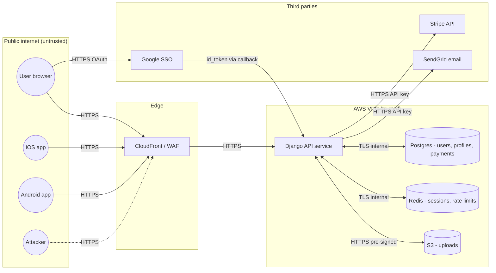

# Week 16: Worked example — Threat Modeling Mentorbase

> No exploitation labs this week. The "attack" here is the *thinking like an attacker* part of design review.

---

## The four questions

Adam Shostack's distillation:

1. **What are we working on?**
2. **What can go wrong?**
3. **What are we going to do about it?**
4. **Did we do a good job?**

Threat modeling is just answering those four questions, in order, with discipline.

## Step 1: What are we working on? Draw the DFD

Data Flow Diagrams use four shapes:

- **Process** (circle / rounded rectangle): runs code, accepts input, produces output
- **External entity** (rectangle): users, third parties, external systems
- **Data store** (parallel lines / cylinder): persisted data
- **Data flow** (arrow): data moving between the above

And one critical element:

- **Trust boundary** (dashed line): the perimeter across which trust changes

### Mentorbase DFD (Mermaid)



Trust boundaries:

| Boundary | Why it matters |
|---|---|
| Public internet → CloudFront/WAF | All input untrusted; WAF rules first line |
| CloudFront → Django API | Should require authenticated requests beyond `/healthz` |
| Django → Postgres | Mutual-TLS, separate VPC subnet |
| Django → Stripe | API key crossing boundary — protect that key |
| Google SSO callback → Django | The `id_token` is the trust transfer; verify aud, iss, sig, exp |

## Step 2: What can go wrong? STRIDE per component

STRIDE applied to each box and arrow:

| Letter | Threat | Affects (data flow vs. stored) | Counter via |
|---|---|---|---|
| **S**poofing | Pretending to be someone | Identity | Authentication |
| **T**ampering | Modifying data | Both | Integrity (signatures, hashes) |
| **R**epudiation | Denying an action | Both | Non-repudiation (logs, audit) |
| **I**nformation disclosure | Exposing data | Both | Confidentiality (encryption, ACL) |
| **D**enial of service | Crashing | Availability | Rate limits, scale, design |
| **E**levation of privilege | Getting more rights | Authz | Permission checks |

### STRIDE for "Django API service" (process)

| Threat | Specific instance | Severity | Reference week |
|---|---|---|---|
| Spoofing | Stolen JWT replays as user X | High | Week 02 |
| Spoofing | Session fixation lets attacker assume known session ID | High | Week 02 |
| Spoofing | Forged `id_token` from a fake Google issuer | Critical | Week 02 |
| Tampering | Mass assignment lets user set `is_admin=true` | Critical | Week 13 |
| Tampering | Path traversal on `/files?name=` rewrites server files | High | Week 12 |
| Repudiation | No audit log for "user changed payment method" | Medium | Week 15 |
| Repudiation | Logs locally stored only, attacker wipes them | High | Week 15 |
| Info disclosure | BOLA on `/api/users/<id>` returns other users' data | Critical | Week 13 |
| Info disclosure | BOPLA returns `password_hash`, `totp_secret` | Critical | Week 13 |
| Info disclosure | Verbose error pages leak env vars | High | Week 14 |
| Info disclosure | SSRF to `/169.254.169.254/` leaks IAM creds | Critical | Week 08 |
| DoS | No rate limit on `/login` enables credential stuffing | High | Week 04 |
| DoS | XML billion-laughs on `/api/import` | Medium | Week 12 |
| DoS | Slow-loris on the Python WSGI server (no concurrency cap) | Medium | Operational |
| Elevation of privilege | RCE via Log4Shell-equivalent in deployed library | Critical | Week 14 |
| Elevation of privilege | RCE via Jinja2 template injection in admin tool | Critical | Week 07 |
| Elevation of privilege | Insecure pickle deserialization in Celery queue | Critical | Week 11 |
| Elevation of privilege | Mass assignment → privilege change | Critical | Week 13 |

### STRIDE for "Postgres" (data store)

| Threat | Specific instance | Severity |
|---|---|---|
| Spoofing | App connects with shared DB password from compromised secret store | High |
| Tampering | SQL injection from API rewrites tables | Critical (Week 05) |
| Repudiation | No `created_at` / `created_by` on critical tables | Medium |
| Info disclosure | Backup files left in `/backup/` on web server | Critical (Week 14) |
| Info disclosure | Replica DB in a less-secured region | High |
| DoS | Unbounded query from API (no LIMIT) | Medium |
| Elevation of privilege | App user has `SUPERUSER` (it shouldn't) | Critical |

### STRIDE for "User → CloudFront" data flow

| Threat | Specific instance | Severity |
|---|---|---|
| Spoofing | Phished session cookie replayed | High |
| Tampering | MITM on user's network without HSTS | High (Week 10) |
| Repudiation | User claims "I didn't make this transfer" — without device fingerprint | Medium |
| Info disclosure | Credentials in URL query strings (cached in browser history) | Medium |
| DoS | DDoS exhausts CloudFront-allowed origin requests | Medium |
| Elevation of privilege | XSS payload steals session token (Week 06) | High |

### STRIDE for "Django → Stripe" data flow

| Threat | Specific instance | Severity |
|---|---|---|
| Spoofing | Webhook callback from non-Stripe IP impersonates Stripe | Critical |
| Tampering | Modified webhook body (signature not verified) | Critical |
| Repudiation | "Stripe payment succeeded but our DB says it didn't" — no idempotency key | High |
| Info disclosure | Stripe key in Django logs / Sentry traces | Critical |
| DoS | Retry storm overwhelms Stripe rate limit | Medium |
| Elevation of privilege | Stripe live-key vs test-key confusion lets test transactions move real money | High |

The exercise — done with discipline for every component — produces 50-150 threats for a typical web app. That's the right number. You're not going to fix them all; you're going to pick the top N.

## Step 3: Attack trees for high-value flows

STRIDE gives breadth; attack trees give depth. Pick a critical goal; decompose how an attacker reaches it.

### Goal: Compromise a paid mentor's account

```
GOAL: Attacker controls victim mentor's account
├── PATH 1: Credential theft
│   ├── Phishing victim ──┐
│   │                     ├── No-2FA-by-default mitigates
│   │                     └── Lookalike domain check
│   ├── Credential stuffing
│   │   ├── Leaked from another site (Week 04)
│   │   ├── Defeats: HIBP check at password creation
│   │   └── Defeats: per-IP & per-account rate limits
│   ├── Brute force
│   │   └── Defeats: per-account rate + CAPTCHA after N
│   └── Password reset hijack
│       ├── Predictable reset tokens (Week 10)
│       └── Email account hacked (out of scope but trackable)
│
├── PATH 2: Session theft
│   ├── XSS steals cookie (Week 06)
│   │   ├── Defeats: CSP + HttpOnly cookies + strict template autoescape
│   │   └── Defeats: SameSite=Strict + per-session anti-token
│   ├── Network MITM
│   │   └── Defeats: HSTS preload + only-secure cookies
│   └── Session fixation
│       └── Defeats: rotate session on login (Week 02)
│
├── PATH 3: Account takeover via API
│   ├── BOLA / IDOR change password without current pw
│   │   └── Defeats: every password change requires re-auth
│   ├── Mass assignment sets new email (Week 13)
│   │   └── Defeats: explicit schema; email change requires confirm to old
│   └── BOLA on /api/users/<id>/email_change
│       └── Defeats: ownership check
│
├── PATH 4: Identity provider compromise
│   ├── Google SSO without aud check
│   │   └── Defeats: validate id_token (aud, iss, sig, exp)
│   ├── Account merging logic
│   │   └── Defeats: explicit confirm on merge
│   └── OAuth refresh token in browser localStorage
│       └── Defeats: refresh token httpOnly cookie OR short-lived access only
│
└── PATH 5: Insider / admin tool misuse
    ├── Support tool "impersonate user" without audit
    │   └── Defeats: log every impersonation, daily review
    └── Database direct write
        └── Defeats: prod DB write access through audit'd gateway only
```

The tree exists to find paths you haven't defended yet. Most well-designed apps cover paths 1-2. Paths 3, 4, 5 are where the actual breach reports live.

## Step 4: Prioritize — DREAD-light scoring

Pure DREAD (Damage, Reproducibility, Exploitability, Affected users, Discoverability — 1-10 each) is famously noisy. Modern practice: rate threats on a simple matrix:

| | Likelihood: Low | Medium | High |
|---|---|---|---|
| **Severity: Critical** | Plan | Fix this quarter | Fix now |
| **Severity: High** | Backlog | Plan | Fix this quarter |
| **Severity: Medium** | Accept (track) | Backlog | Plan |
| **Severity: Low** | Accept | Accept (track) | Backlog |

For the Mentorbase example, top-5 by this rubric:

| # | Threat | S | L | Action | Owner | When |
|---|---|---|---|---|---|---|
| 1 | BOLA across user-scoped endpoints | C | H | Move all endpoints to filtered-queryset pattern | Backend lead | Sprint 1 |
| 2 | Mass assignment on `/api/users/<id>` PUT | C | M | Switch to explicit DTOs; deploy hotfix | Backend lead | Hotfix |
| 3 | No rate limit on `/login` | H | H | Add multi-dim limiter; CAPTCHA after 5 | Platform | Sprint 1 |
| 4 | Stripe webhook signature not verified | C | L | Verify Stripe-Signature header | Payments | Sprint 1 |
| 5 | No audit log for `user.role.changed` | M | M | Emit structured event; alert on it | Backend | Sprint 2 |

The rest of the threat list goes into the backlog with the same fields. Quarterly reviews move them up or down.

## Step 5: Did we do a good job?

Validation:

- **Coverage**: every component has a STRIDE row, even if it's "N/A: read-only static asset, no input."
- **Concreteness**: every threat names a specific endpoint, library, or flow — not "the system might be hacked."
- **Actionable**: every fix is assigned to someone with a date or "accept-with-tracking."
- **Re-visit**: schedule a re-threat-model on architecture change (new third party, new auth flow, new data domain).

A threat model that never gets re-opened isn't a threat model — it's a doc.

## Beyond STRIDE — other frameworks

| Framework | When to use |
|---|---|
| **STRIDE** | General-purpose; web apps default |
| **PASTA** (Process for Attack Simulation and Threat Analysis) | More rigorous, includes business risk; enterprise |
| **LINDDUN** | Privacy-focused (GDPR alignment, healthcare) |
| **OCTAVE** | Org-scale (entire enterprise, not single app) |
| **Attack trees** | Drill into specific high-value goals |
| **Kill chain / MITRE ATT&CK** | Post-deployment, defensive operations |

STRIDE is the right default. The others apply when STRIDE doesn't cover the relevant dimensions (privacy, supply chain, org-wide risk).

## Common pitfalls

- **Threat-modeling theater** — generating a doc, getting it signed, never re-opening it. The doc is a snapshot; the work is the practice.
- **No engineer in the room** — security-only sessions miss the implementation realities. Devs in the session catch "we already do that" or "that's actually hard."
- **Trying to model the whole org** — model components, not your entire architecture. The session that takes a week produces a doc no one reads.
- **Skipping low-severity threats** — they accumulate; they're often what an attacker actually chains.
- **No "accept and track" outcome** — sometimes the right action is "accept the risk for now." That's still a decision; document it.

## Closing — what comes after Week 16

Threat modeling is one thread of a mature AppSec program. After this curriculum:

- **Train engineers** on this curriculum (or similar) — the security team can't be the bottleneck.
- **Continuous AppSec** — bug bounty (HackerOne, Bugcrowd, Intigriti), DAST, SAST, dependency scanning all running in CI.
- **Red team** — internal or hired, periodically simulates real attackers against your detections from Week 15.
- **Specialization** — pick a depth: mobile AppSec, cloud security (CNAPP/CSPM), AppSec engineering for a specific stack, detection engineering, IR/forensics.
- **Community** — DEF CON AppSec Village, OWASP local chapters, Cloud Native Security WG, conferences (Black Hat, DEF CON, Nullcon, Hack in the Box).

Now read [defense.md](defense.md) for SDLC-integration patterns.
