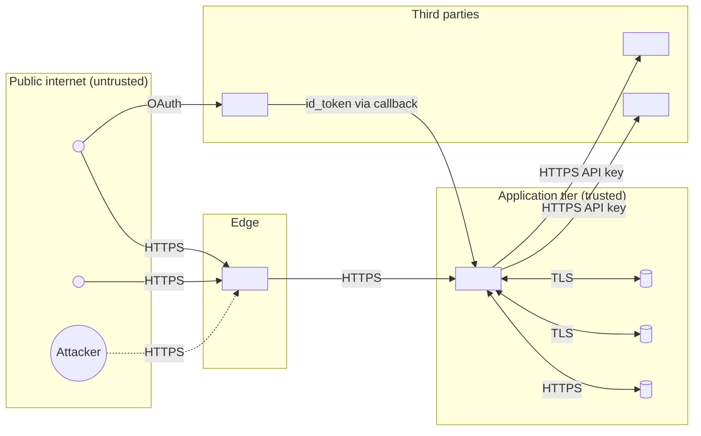

# DFD - `<system or feature name>`

> Fork this file. Replace each `<…>` with the real artifact. Keep the comments - they're prompts for you to answer.

## What you're modeling

<!-- One paragraph. What system? What change? Why is this being threat-modeled now (new service, new auth flow, new third party, quarterly re-visit)? -->

## Diagram

<!--
DFD primitives to keep faithful:
  ((double-circle))  external entity (user, third party, attacker persona)
  [rounded box]      process - runs code, accepts input, produces output
  [(cylinder)]       data store
  -->                data flow (label with protocol / auth)
  subgraph           trust boundary
-->

## Trust boundaries

| Boundary | What changes across it | Authentication carrying trust |
|---|---|---|
| Public → Edge | Untrusted → DDoS-filtered | TLS + WAF rules |
| Edge → App | DDoS-filtered → identified | Session cookie / JWT / API key |
| App → DB | Identified user → DB-internal | mTLS + DB user role |
| App → Vendor X | Outbound trust transfer | API key / signed webhook |
| IDP → App | External claim → internal identity | id_token signature, aud, iss, exp |

## Assets crossing each boundary

| Boundary | Data flowing across | Sensitivity |
|---|---|---|
| Public → Edge | All input | Untrusted |
| Edge → App | Validated requests | Untrusted but typed |
| App → DB | User records, payments | PII / financial |
| App → Vendor X | <list> | <classify> |

## Out of scope

<!-- Be explicit. "Network-layer DDoS - covered by CDN vendor SLA." "Physical security of AWS - accepted." Future-you reading this needs to know what was deliberately not modeled. -->

## Next: see [stride-worksheet.md](stride-worksheet.md) for STRIDE per component.
